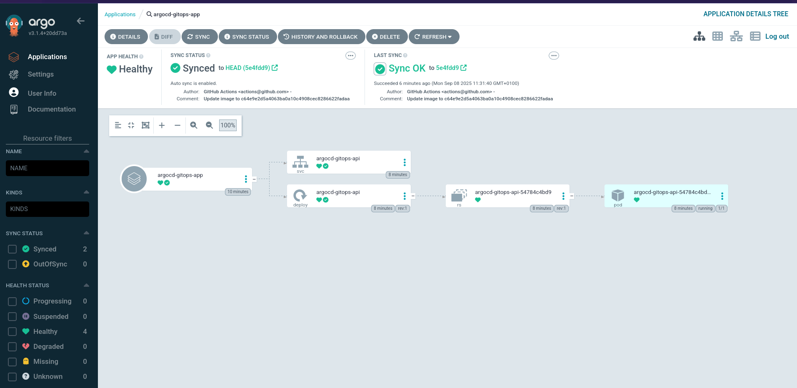

## Requirements
- Client Version: v1.33.1
- Kustomize Version: v5.6.0
- Server Version: v1.33.1
- Helm Version: v3.18.6

## Install ArgoCD

```bash
helm repo add argo https://argoproj.github.io/argo-helm
helm repo update
kubectl create namespace argocd
helm install argocd argo/argo-cd --namespace argocd
```

## Retrieve Credentials

```bash
kubectl -n argocd get secret argocd-initial-admin-secret -o jsonpath="{.data.password}" | base64 -d
```
## ArgoCD Application

```bash
cd argocd/applications/
```

## Creating Image Pull Secrets

To allow Kubernetes to pull images from GitHub Container Registry:

```yaml
kubectl create secret docker-registry ghcr-secret \\
  --docker-server=ghcr.io \\
  --docker-username=YOUR_USERNAME \\
  --docker-password=YOUR_PAT \\
  --namespace=argocd-gitops
```

## Applying changes to ArgoCD Application

Verify the ArgoCD services are running and apply the application manifest

```bash
kubectl get svc -n argocd
kubectl apply -f argocd/applications/basic-application.yaml
```


## Access ArgoCD UI

```bash
kubectl port-forward svc/argocd-server -n argocd 8080:80
```

## Verify whether pod instances are nunning




 